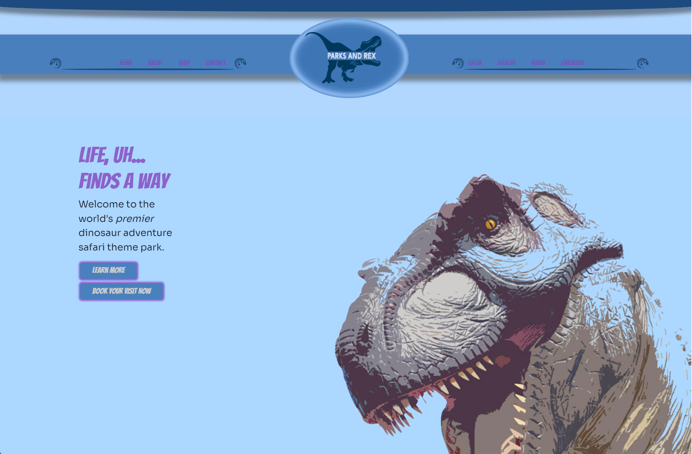
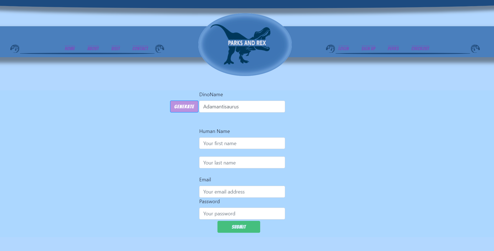
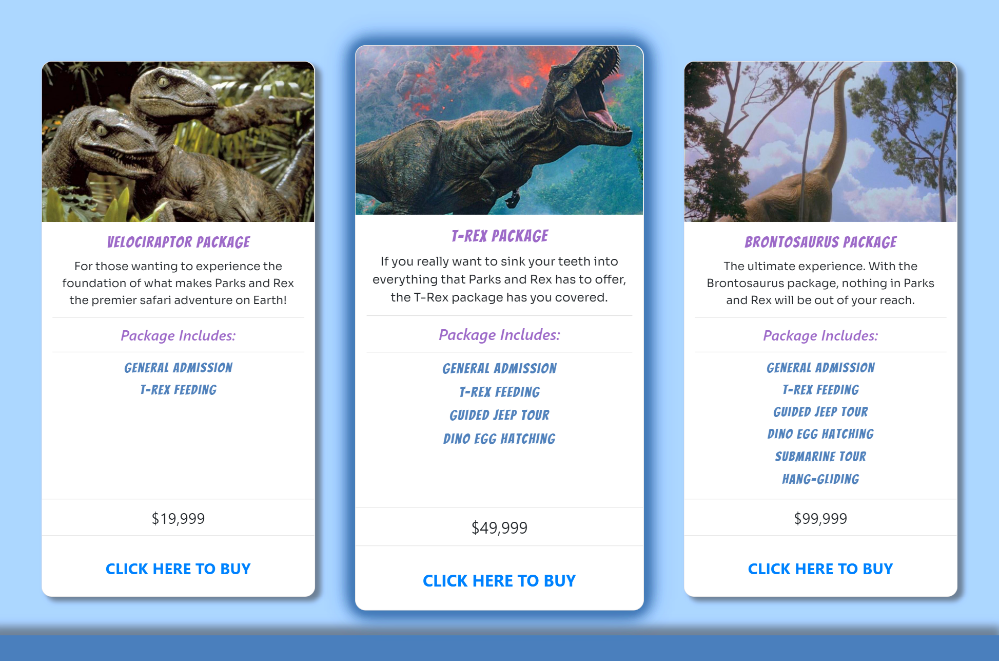
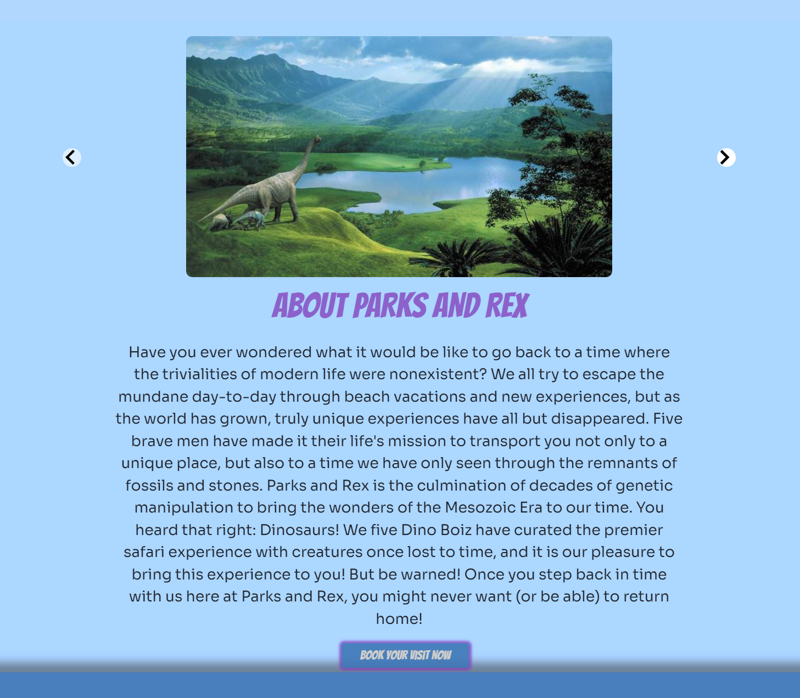

#   🌴 PARKS & REX 🌴

>>>> ### **The Darkside Dino Boiz**  
>>>> ###  *present*   
>>>>>> ###  **Parks & Rex**

## *DESCRIPTION* 

>> Parks & Rex is a delightful e-commerce platform through which a user can purchase admission to witness the best-kept secret of the 21st-century:  *Living Dinosaurs*  
>> We five Dino Boiz have curated the premier safari experience with creatures once lost to time, and it is our pleasure to bring this experience to the worldwide public with the launch of our brand new online application. 
>> Using the parks & rex e-commerce platform we have built, it has never been easier to pursue an impossible dream.

## *Table of Contents*
### (*Internal navigation links*)
- [The User Story](#the-user-story)
- [Features](#features)
- [Implemented Tech](#implemented-tech)
- [Screenshots](#screenshots)
- [Live](#live)  
- [Meet the Creators](#meet-the-creators)

___  
___
___
> ### **The User Story**
>>>  *The heart of the matter*  
>>>>  - AS A thrill-seeking human with an adventurous spirit  
>>>>  - I WISH FOR a fun, convenient way to book a unique trip  
>>>>  - SO THAT I can embark on the experience of a lifetime
___  
___
___  
> ### **Features**
>>>  *The rundown on functionality*  
>>>>  - The Parks & Rex landing page presents the user with immersive visuals and invites the user to explore the application.  
>>>>  - Upon visiting the signup page, the user may choose to generate a unique username which will be their identifier in future updates wherein the site can be revisited to join the conversation with the Parks & Rex fan community. Upon submission of personal credentials, a unique account is created for the user.  
>>>>  - Persistent and secure user credentials allow the user to revisit the site assured that their sensitive information is safe.  
>>>>  - The user visits the shop page to investigate the park's various entertainment offerings and evaluate their preferred experience.  
>>>>  - Upon choosing a tour package, the user is redirected to the checkout page wherein a future update will allow for online purchases to be made quickly and securely.  
>>>>  - The user visits the Perks page to preview the individual single-ticket items to be made available soon.   
>>>>  - The user clicks the navbar link to navigate to the About page, where they can read more about our mission at Parks & Rex and view professional photographs of the park's main attractions.  
>>>>  - The user navigates to the Contact page to input a message in a form and submit the message to be sent to the park administrators.  
___  
___
___  
> ### **Implemented Tech**
>>>  *Under the Hood*  
>>>>  **Building MVC architecture with the MERN stack**  
>>>  - `Node.js` serves as the runtime environment wherein development is conducted, alongside Node Package Manager which streamlines and optimizes the use of project dependencies.  
>>>  - `Express.js` is implemented to manage request and response communication between front and back end.  
>>>  - `React.js` paints dynamic data onto the front-end, allowing our team to engineer a personalized and scalable user experience.  `React-bootstrap` allows for convenient templating of UI components. 
>>>  - `MongoDB` stores data modeled by `Mongoose`.  
>>>  - `Apollo` serves as a proxy, resolving front-end data requests through `graphQL` queries and mutations.  
>>>  - The `bcrypt` node package handles hashing and salting of user passphrases for fully authenticated account access, alongside the user context middleware offered by `Apollo`.  
>>>  - A service worker is implemented alongside `workbox` to cache data for potential application use in an offline network state.  
>>>  - Special thanks to [Dino Ipsum](https://dinoipsum.com/) API for data fetched using `axios`.  
>>>  - `Stripe` to be implemented in a future release to allow for digital purchases on the application.  
___  
___
___  
> ### **Screenshots**
>>>  *Check it out*  
>>>>  
___    
>>>>   
___
>>>>  
___  
>>>>  
___
___  
> ### **Live**
>>>  *At home in the cloud*  
>>>>  [Parks & Rex Deployed]()
___  
___
___  

## Meet the Creators

> ### [Alex Macon](https://github.com/alexdmacon)
> ### [Brandyn Huffer](https://github.com/brandynh)
> ### [Joshua Diehl](https://github.com/JaynewDee)
> ### [Austin Pratt](https://github.com/hargis32)
> ### [Zach Rojas](https://github.com/zachrojas)

